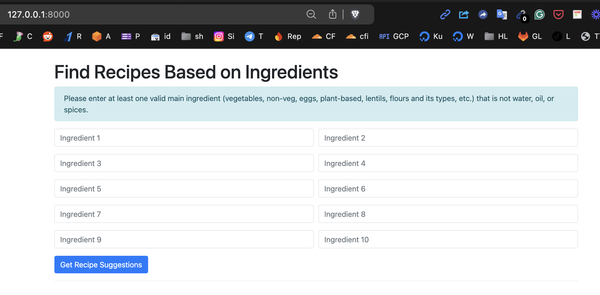

# 🍛 The "What's Cooking?" Recipe Generator
### *Because "What's for dinner?" shouldn't sound like an existential crisis*

[]()
[]()
[]()

*\*Results may vary. Your mom's approval not guaranteed. Terms and conditions apply.*

## 🌶️ What's This Spicy Business?

Ever stood in your kitchen, staring at random vegetables like they're abstract art? Wondering if that lonely potato and abandoned bell pepper could become something more than just roommates in your fridge? Well, wonder no more!

This Django-powered kitchen companion is here to rescue you from the depths of culinary confusion. Simply tell it what ingredients you have, and it will magically suggest Indian dishes you can make - complete with recipes that even your grandmother would *probably* approve of.

## 🚀 Features That'll Spice Up Your Life

- **10 Ingredient Fields**: Because who doesn't love the satisfaction of filling out forms?
- **AI-Powered Suggestions**: Like having an Indian aunty in your computer, minus the "Why aren't you married yet?" questions
- **Bilingual Support**: Enter ingredients in English or Hindi - we don't judge
- **Real-time Results**: Faster than your pressure cooker's whistle
- **Mobile Responsive**: Use it while grocery shopping (and impress random strangers)

## 🛠️ Installation: Easier Than Making Maggi!

```bash
# Clone this repo (Don't worry, it won't clone your cooking skills)
git clone https://github.com/sachnaror/recipes-project.git

# Enter the magical realm
cd recipes-project

# Install dependencies (Like gathering spices, but less messy)
pip install -r requirements.txt

# Run migrations (No, not the kind where you move to a new city)
python manage.py migrate

# Start the server (Promise it's easier than starting a gas stove)
python manage.py runserver
```

## 🎯 Prerequisites

- Python 3.12
- Django (The framework, not the movie)
- OpenAI API key (More valuable than your secret family recipes)
- Basic cooking skills (Optional, but highly recommended)
- A sense of humor (Required)

## 🎨 Environment Variables

```env
OPENAI_API_KEY=your_super_secret_key_here
DJANGO_SECRET_KEY=another_super_secret_key
MOM_APPROVAL_RATING=100  # This one's optional but who are we kidding
```

### Backend (`views.py`):
- After retrieving the recipe suggestions from OpenAI, I loop over the suggestions to create a Google Image search URL for each one.
- The URL is created by taking the recipe name and appending it to `https://www.google.com/search?tbm=isch&q=`, which opens the Google Images search page with the query.

### Frontend (`index.html`):
- I modified the loop to display the recipe name and an associated “View Images” link, which points to the Google Image search result for that recipe.

### Google Image Search Link:
- For example, if a recipe suggestion is “Aloo Gobi”, the link would look like:
  `https://www.google.com/search?tbm=isch&q=Aloo+Gobi`.

### Result:
Now when the user submits ingredients and the AI suggests dishes, each dish will have a link to its image search on Google. This enhances the user experience by letting them see images of the dishes alongside the suggestions.


## 🤔 FAQ (Frequently Assumed Queries)

**Q: Will this make my cooking taste better?**
A: We're developers, not miracle workers.

**Q: Can I enter "love" as an ingredient?**
A: No, but you can enter "pyaar" - same thing, different language.

**Q: Why do I need AI to tell me what to cook?**
A: Because sometimes "random kitchen chaos" needs structure.

**Q: Will this replace my mom's cooking?**
A: 🤣🤣🤣 Oh, you were serious? No.

## 🐛 Known Bugs

- Occasionally suggests making biryani when you clearly don't have enough ingredients
- May cause sudden cravings
- Could lead to spontaneous cooking sessions
- Might make your mom slightly jealous

## 👩‍💻 Contributing

Found a bug? Want to add a feature? Know a better recipe for dal? We welcome all contributions! Just:

1. Fork it (not the food)
2. Create your feature branch
3. Commit your changes
4. Push to the branch
5. Create a Pull Request
6. Wait for feedback while making chai

## 📜 License

This project is licensed under the MIT License - because sharing is caring, just like how your mom shares food with the entire neighborhood.

## 🙏 Acknowledgments

- To all the moms who said "just add a pinch of this"
- To all the dads who tried to cook and created new recipes by accident
- To Stack Overflow, for solving everything except our cooking problems
- To that one YouTube cook who actually shows the real measurements

---

*Made with ❤️ and probably too much garam masala*

**Note**: *No vegetables were harmed in the making of this project. We cannot say the same for the testing phase.*

```
Remember: With great recipes comes great responsibility!
```



```
├── recipes_project/
│   ├── requirements.txt
│   ├── db.sqlite3
│   ├── README.md
│   ├── .env
│   ├── debug.log
│   ├── manage.py
│   ├── image.png
│   ├── recipe_app/
│   │   ├── models.py
│   │   ├── apps.py
│   │   ├── admin.py
│   │   ├── tests.py
│   │   ├── urls.py
│   │   └── views.py
│   ├── recipes_project/
│   │   ├── asgi.py
│   │   ├── settings.py
│   │   ├── urls.py
│   │   └── wsgi.py
│   ├── templates/
│   │   └── index.html
